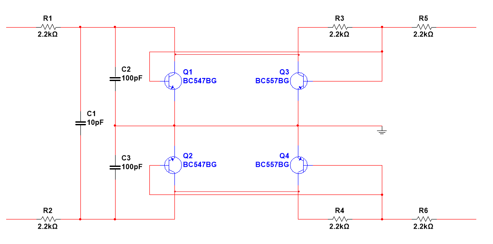
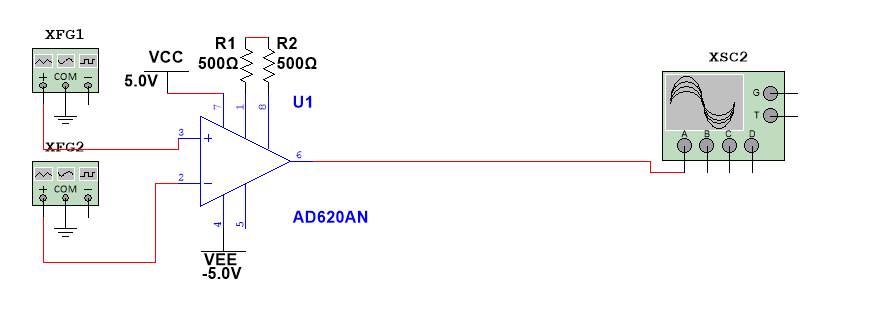
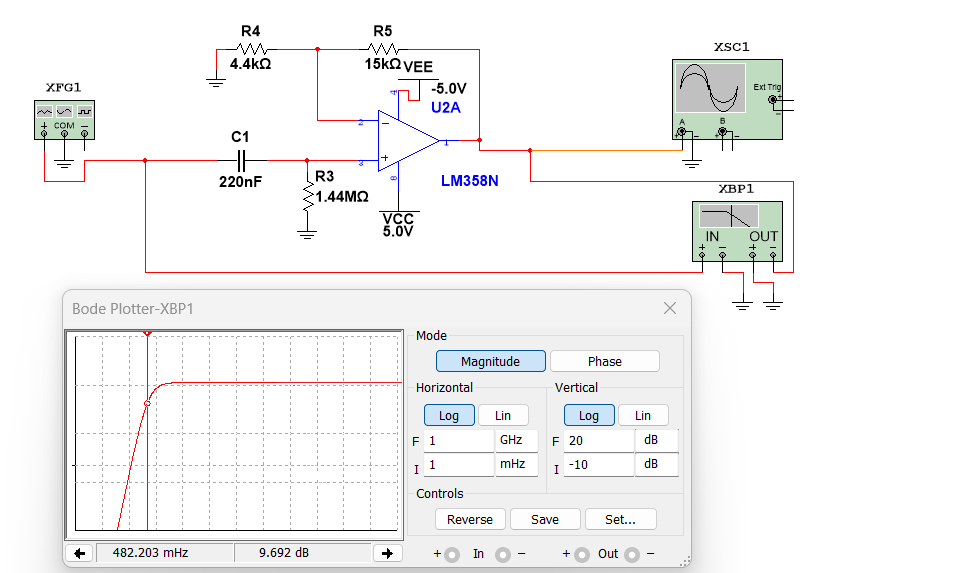
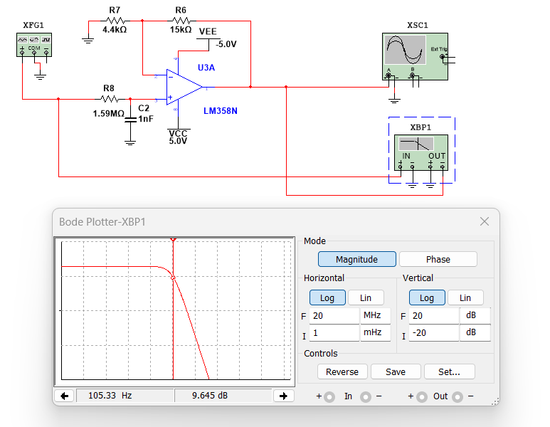
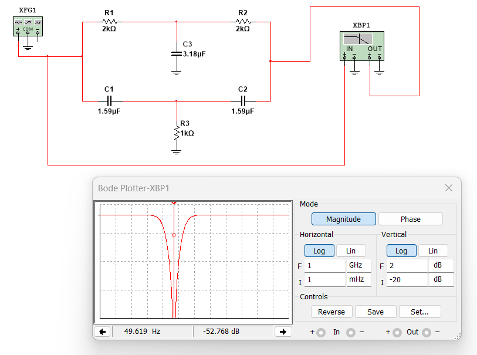
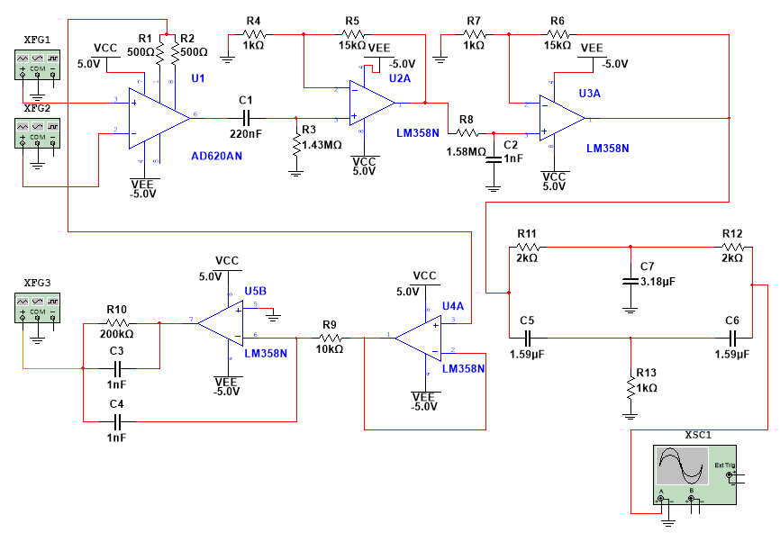
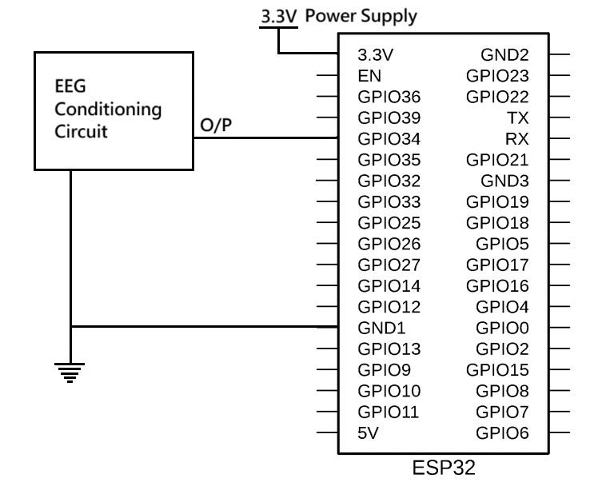

# Wireless EEG Machine
Implementation of a Wi-Fi Based Electroencephalogram (EEG) Monitoring System using ESP32 and a Single-Channel EEG Acquisition Circuit.

## Project Description
This project focuses on the design and development of a low-cost, portable, single-channel wireless EEG monitoring system. The system captures microvolt-level bioelectric signals from the scalp via a custom-built analog front-end, digitizes them using an ESP32 microcontroller, and transmits the data in real-time over Wi-Fi. A web-based dashboard visualizes the live EEG waveform and performs frequency analysis to separate standard brainwave bands.

## System Architecture
The system consists of four main functional blocks:
* **Signal Acquisition:** Non-invasive electrodes capture raw brainwave signals.
* **Conditioning Circuit:** An analog front-end that amplifies and filters signals to isolate frequencies between 0.5 and 100 Hz while rejecting noise.
* **Digitization:** An ESP32 samples the conditioned signal at 250 Hz using its 12-bit ADC.
* **Transmission:** Real-time data streaming to a client device via the WebSocket protocol to minimize latency.

## Hardware Specifications

### Analog Front-End
* **Instrumentation Amplifier:** **AD620** for high-accuracy, low-noise initial amplification.
* **High-Pass Filter:** Active first-order RC filter with a cutoff of approximately 0.5 Hz to remove DC offset.
* **Low-Pass Filter:** Active filter with a cutoff of 100 Hz to eliminate high-frequency noise and muscle artifacts.
* **Notch Filter:** 50 Hz Twin-T notch filter to remove power line interference.
* **Driven Right Leg (DRL) Circuit:** Actively minimizes common-mode interference to enhance signal quality.

### Microcontroller
* **Model:** **ESP32-WROOM-32**
* **ADC:** 12-bit resolution on **GPIO34**
* **Communication:** Integrated Wi-Fi module serving as a WebSocket server

## Software Requirements
The following Arduino libraries are required to compile the firmware:
* **Async_TCP**
* **ESPAsyncTCP**
* **ESPAsyncWebServer**
* **WebSockets**

## Repository Structure
* **/firmware**: ESP32 source code in `.ino` format.
* **/web_interface**: HTML and JavaScript files for the dashboard.
* **/circuits**: NI Multisim circuit files and schematics.
* **/docs**: Full technical project report in PDF format.

## Circuit Schematics

### Signal Conditioning Stage

 
*Figure 1: Basic Protection circuit.*

 
*Figure 2: Instrumentation amplifier.*

 
*Figure 3: High pass filter with Bode plot.*

 
*Figure 4: Low pass filter with Bode plot.*

 
*Figure 5: Notch filter with Bode plot.*

 
*Figure 6: Complete EEG circuit.*

### ESP32 Interface

 
*Figure 7: Interfacing the analog front-end with the ESP32.*

## How to Run
1. Connect the EEG electrodes to the acquisition circuit and link the output to the **ESP32 ADC pin**.
2. Upload the code found in the **/firmware** directory to your ESP32 using the Arduino IDE.
3. Ensure your PC or tablet is connected to the same Wi-Fi network as the ESP32.
4. Open **index.html** in a web browser to view the live EEG stream.

---

For a detailed technical analysis including gain calculations and test results, please refer to the [Full Project Report](./docs/Wireless_EEG_Machine_Project.pdf).

